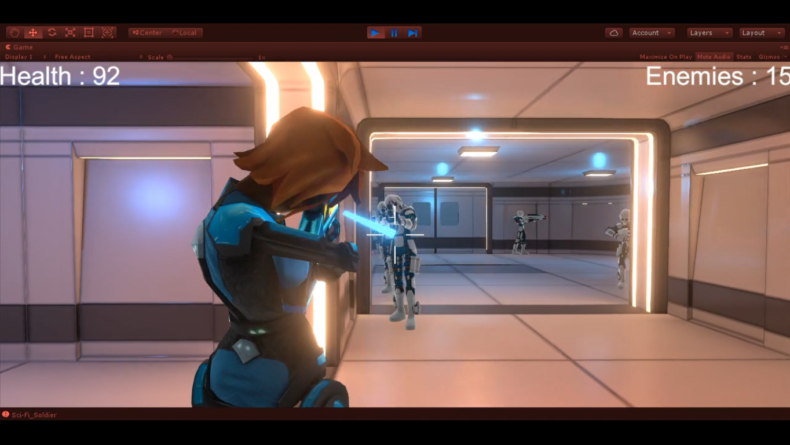
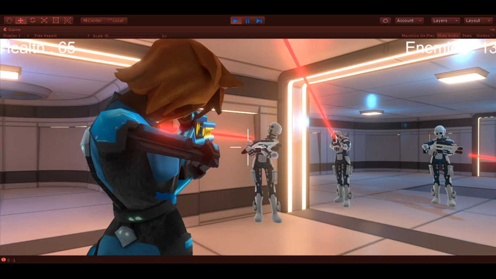
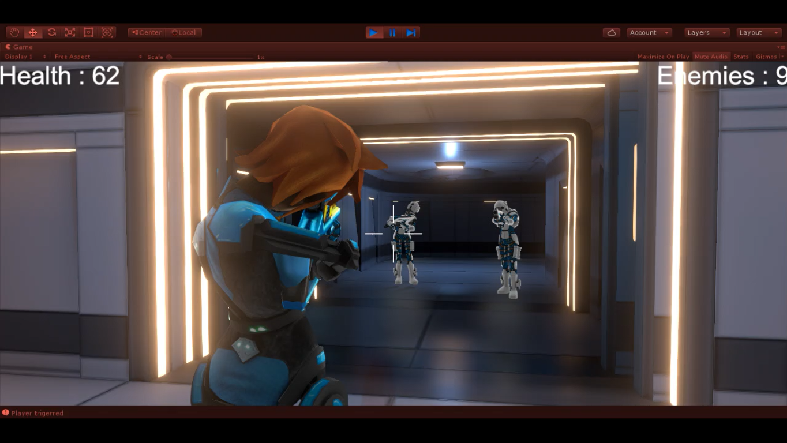
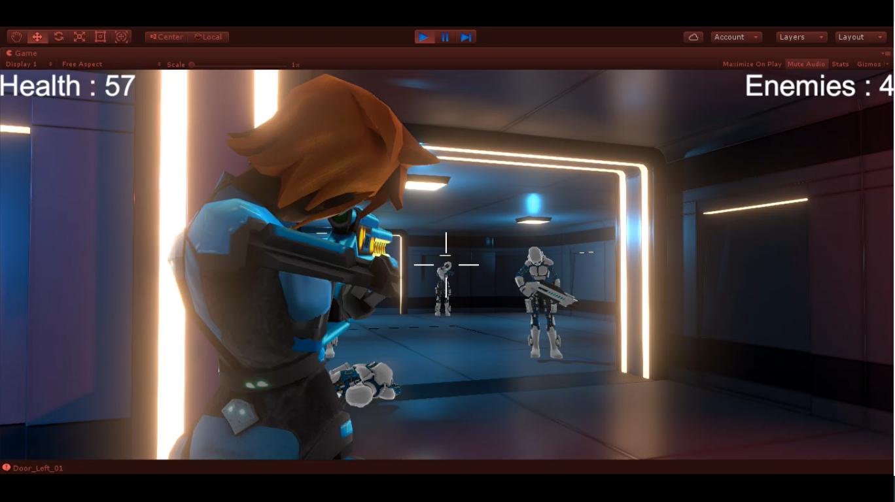

# scifi-shooter
This is a multiplayer shooting game made in unity. It is based on Battle Royale strategy where different players join a lobby through internet (here we use free unity server providing upto 20 free users) and are spawned in the map and have a task to kill each other.

## Screenshots

## Directions to use
Just clone the repo and open the *test_map.unity* scene inside Unity.  
*Unity Version :-* 2018.3.14f1

## Demo
To play the demo, just unzip the *Build.zip* file and open the *SA Course Project.exe*. Choose your preferred resolution and graphics setting, and click *Play*.

## References
- **3D Free Modular Kit** https://assetstore.unity.com/packages/3d/environments/3d-free-modular-kit-85732
- **Sci-Fi Cyborg Girl** https://assetstore.unity.com/packages/3d/characters/humanoids/sci-fi-cyborg-girl-35921
- **Sci-Fi Soldier** https://assetstore.unity.com/packages/3d/characters/humanoids/sci-fi-soldier-29559
